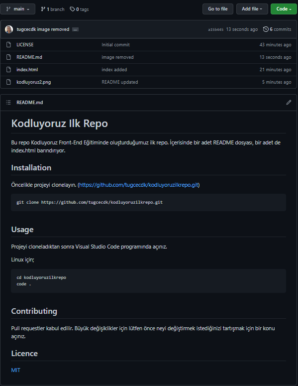

# Kodluyoruz Ilk Repo
Bu repo Kodluyoruz Front-End Eğitiminde oluşturduğumuz ilk repo. İçerisinde bir adet README dosyası, bir adet de index.html barındırıyor.



## Installation
Öncelikle projeyi clonelayın. (https://github.com/tugcecdk/kodluyoruzilkrepo.git)

```
git clone https://github.com/tugcecdk/kodluyoruzilkrepo.git
```

## Usage
Projeyi cloneladıktan sonra Visual Studio Code programında açınız.

Linux için;
```
cd kodluyoruzilkrepo
code .
```

## Contributing
Pull requestler kabul edilir. Büyük değişiklikler için lütfen önce neyi değiştirmek istediğinizi tartışmak için bir konu açınız.

## Licence
[MIT](https://choosealicense.com/licenses/mit/)